# Entity-Relationship Diagram

> High-level relationships between core Helpster Care entities.
> Reference: `AGENTS.md` §87–§112, §184.

```mermaid
erDiagram
    users ||--o{ user_roles : has
    roles ||--o{ user_roles : grants
    roles ||--o{ role_permissions : includes
    permissions ||--o{ role_permissions : granted_by
    users ||--o{ sessions : owns

    hospitals ||--o{ departments : contains
    hospitals ||--o{ wards : contains
    departments ||--o{ beds : organizes
    wards ||--o{ beds : holds
    hospitals ||--o{ operating_theatres : contains
    users ||--o{ hospital_assignments : assigned
    hospitals ||--o{ hospital_assignments : scoped_to

    patients ||--o{ patient_assignments : assigned_to
    users ||--o{ patient_assignments : responsible
    patients ||--o{ patient_contacts : has
    patients ||--o{ patient_addresses : has
    patients ||--o{ patient_guardians : has
    patients ||--o{ patient_history : records
    patients ||--o{ patient_notes : notes
    patients ||--o{ patient_status_history : transitions
    hospitals ||--o{ patients : hosts

    patients ||--o{ treatments : receives
    treatments ||--o| conservative_treatments : specializes
    treatments ||--o| surgical_treatments : specializes
    surgical_treatments ||--o{ surgeries : includes
    operating_theatres ||--o{ ot_schedules : booked_in
    surgeries ||--o{ ot_schedules : scheduled
    patients ||--o{ followups : scheduled
    patients ||--o{ diagnoses : diagnosed
    patients ||--o{ prescriptions : prescribed

    patients ||--o{ documents : owns
    document_categories ||--o{ documents : classifies
    documents ||--o{ document_versions : versioned
    documents ||--o{ attachments : includes

    patients ||--o{ approvals : subject_of
    approvals ||--o{ approval_history : logs
    workflow_states ||--o{ workflow_transitions : from_to

    users ||--o{ notifications : receives
    notification_templates ||--o{ notifications : renders

    users ||--o{ audit_logs : performed
    patients ||--o{ activity_timeline : timeline
```

## Notes

- **Identity → Authorization:** `users → user_roles → roles → role_permissions →
  permissions`. See [ADR-0004](../architecture/ADR-0004-rbac-rebac.md).
- **ReBAC scope:** `hospital_assignments` and `patient_assignments` gate record
  visibility (§70–§72).
- **Timeline vs Audit:** `activity_timeline` is operational history;
  `audit_logs` is immutable compliance history. They are **never** combined
  (§60, §92).
- **Treatment hierarchy:** `treatments` is the abstract parent; concrete types
  are `conservative_treatments` and `surgical_treatments` (§97–§99).
- **Binaries:** documents store metadata only; files live in Supabase Storage
  (§197, [ADR-0005](../architecture/ADR-0005-storage-strategy.md)).

> Render this diagram with any Mermaid-compatible viewer (GitHub renders it
> natively).
